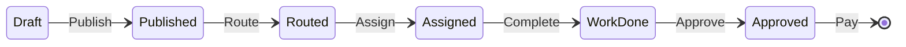

# Work Orders Overview

A **Work Order** is the fundamental unit of work in the Field Nation ecosystem. It represents a job to be done, a contract between a Buyer and a Provider, and a record of the work performed.

This section covers the **Client API** endpoints for creating and managing work orders.

## Core Concepts

Before diving into the endpoints, it's crucial to understand a few key terms:

| Term | Definition |
|------|------------|
| **Buyer** | You (or your client). The entity creating the work order and paying for the work. |
| **Provider** | The technician or contractor who performs the work. |
| **Marketplace** | The open network of providers. You can "Route" work to the marketplace to find new talent. |
| **Private Network** | Your curated list of preferred providers. |
| **Draft** | The initial state of a work order. Visible only to you. |
| **Routed** | The state where work is available for providers to request. |
| **Assigned** | The state where a specific provider is contracted to do the work. |

## The Lifecycle

A work order acts as a state machine. You move it through specific stages using API actions.

1. **Create**: Build the definition of work (Scope, Location, Pay).
2. **Publish**: Make it "live" (but not yet visible to specific people).
3. **Route**: Send it to a specific provider, a group, or the marketplace.
4. **Assign**: Confirm the contract with a specific provider.
5. **Manage**: The provider does the work (Check-in, Uploads, Check-out).
6. **Approve**: You verify the work and release payment.

## Before You Begin

To successfully create and manage work orders, you will need to reference other resources. **You cannot usually just "guess" IDs.**

### 1. Get Your Tokens

Ensure you have a valid Oauth2 access token.

### 2. Fetch Metadata

Most dropdowns or ID fields in the Work Order payload come from these lookup endpoints:

- **Types of Work**: `GET /types-of-work` (Required for creation)
- **Service Contracts**: `GET /service-contracts` (Who pays for this?)
- **Projects**: `GET /projects` (Optional organization)

### 3. Build Your Network

If you plan to route to specific people, you need their IDs:

- **Providers**: `GET /providers` or `GET /talent-pools`

## Next Steps

Start by learning how to construct the work order payload.

- **Next:** [Create Work Order](create.md)
