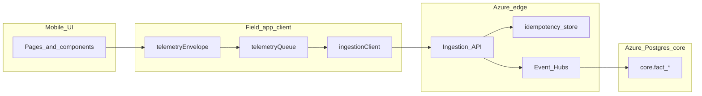

# Field App UI, TechPulse Ingestion, and Azure Mapping

**Single execution guide** for building the Purpulse field app so it captures **model-ready telemetry**, feeds **Azure `core.fact_*` tables**, and supports both **geospatial map UX** and a clear **data pipeline map** from UI actions to downstream models.

**Implementing with Cursor:** use the ordered iteration index and copy-paste prompt template in [CURSOR_FIELD_APP_ITERATIONS.md](CURSOR_FIELD_APP_ITERATIONS.md).

---

## 1. Purpose and scope

### In scope

- **Mobile field-app UI** changes that capture TechPulse **required Day-1** datapoints: dispatch, travel, arrival, runbook steps, QC pass/fail, closeout completion, plus core IDs and timestamps on every event ([TechPulse Field App Guide §5](../../TechPulse_Full_Lineage_Atlas_Package/TechPulse_Field_App_Data_Collection_and_Model_Mapping_Guide.md)).
- **Automatic ingestion**: canonical event envelopes, offline queue, flush to an ingestion API → Event Hubs → Azure Postgres `core.fact_*` (see [Azure Analysis/ingestion_strategy.md](../../Azure%20Analysis/ingestion_strategy.md), [IMPLEMENTATION_PLAN.md](IMPLEMENTATION_PLAN.md)).
- **Geospatial map**: embedded or hybrid map UX (site pin, travel mode, phased geofence) wired to `travel_event` / `arrival_event` with **consent-aware** location.
- **Pipeline map**: explicit trace from **user action → `event_name` → `core.fact_*` → feature/serving tables → models** ([TechPulse_Azure_Database_Master_Documentation.md](../../TechPulse_Full_Lineage_Atlas_Package/TechPulse_Azure_Database_Master_Documentation.md), [TechPulse_Azure_Model_Catalog.csv](../../TechPulse_Full_Lineage_Atlas_Package/TechPulse_Azure_Model_Catalog.csv)).

### Out of scope (documented for clarity)

- **Field Nation REST work order CRUD** from the handset — that is buyer/Purpulse.app integration; see [FieldnationInstructions/](../field-nation/) and Purpulse.app `docs/FIELD_NATION_WORK_ORDER_FLOW.md`. The field app consumes **jobs/runbooks** after identity resolution; TechPulse **core facts** come from **in-app canonical events**, not from calling FN APIs on device for model training.
- Full **bronze/silver ETL** implementation — this README assumes downstream pipelines land normalized rows into `core.*`; field app responsibility stops at **valid, idempotent ingestion**.

---

## 2. Source-of-truth files (repo paths)

| Purpose | Path |
|--------|------|
| Field-app handoff: event families, minimum contract, required vs optional | [TechPulse_Full_Lineage_Atlas_Package/TechPulse_Field_App_Data_Collection_and_Model_Mapping_Guide.md](../../TechPulse_Full_Lineage_Atlas_Package/TechPulse_Field_App_Data_Collection_and_Model_Mapping_Guide.md) |
| Atlas overview: token counts, lineage file names | [TechPulse_Full_Lineage_Atlas_Package/TechPulse_Full_Data_Lineage_Atlas.md](../../TechPulse_Full_Lineage_Atlas_Package/TechPulse_Full_Data_Lineage_Atlas.md) |
| Raw datapoint → features/models (260 tokens) | [TechPulse_Full_Lineage_Atlas_Package/TechPulse_Raw_DataPoint_Dictionary_Exploded.csv](../../TechPulse_Full_Lineage_Atlas_Package/TechPulse_Raw_DataPoint_Dictionary_Exploded.csv) |
| Feature lineage (3187 rows) | [TechPulse_Full_Lineage_Atlas_Package/TechPulse_Full_Feature_DataPoint_Lineage.csv](../../TechPulse_Full_Lineage_Atlas_Package/TechPulse_Full_Feature_DataPoint_Lineage.csv) |
| Model catalog (datasets, outputs, UI surfaces) | [TechPulse_Full_Lineage_Atlas_Package/TechPulse_Azure_Model_Catalog.csv](../../TechPulse_Full_Lineage_Atlas_Package/TechPulse_Azure_Model_Catalog.csv) |
| Azure `core` / `feature` / `serving` table list | [TechPulse_Full_Lineage_Atlas_Package/TechPulse_Azure_Database_Master_Documentation.md](../../TechPulse_Full_Lineage_Atlas_Package/TechPulse_Azure_Database_Master_Documentation.md) |
| Implementation sequencing (foundation → events → Azure) | [IMPLEMENTATION_PLAN.md](IMPLEMENTATION_PLAN.md) |
| Coverage gaps, missing_items, audit, patches, canonical JSON schemas | [Azure Analysis/](../../Azure%20Analysis/) — `audit_report.md`, `coverage_matrix.md`, `missing_items.md`, `ingestion_strategy.md`, `repo_datapoint_mapping.csv`, `dispatch_event.json`, `travel_event.json`, `arrival_event.json`, patches `0001`–`0003` |
| Field Nation API (work orders; assignment context) | [FieldnationInstructions/](../field-nation/) |

---

## 3. Minimum event contract (TechPulse §3)

Every canonical event payload should include:

| Field | Notes |
|-------|--------|
| `event_id` | UUID — idempotency key |
| `event_ts_utc` | UTC ISO8601 |
| `technician_id` | Stable, non-PII (not email) |
| `job_id` | Required for job-scoped facts |
| `site_id` | When applicable |
| `domain_code` / `subdomain_code` | When applicable |
| `source_system` | `"field_app"` |
| Event-specific attributes | Per family (see §7 pipeline table) |

**Recommended:** `device_ts_local`, `app_version`, `os_version`, `connectivity_state`, `event_sequence_no`, `payload_version`, **`schema_version`** (semver on envelope).

**Reference schemas:** [Azure Analysis/dispatch_event.json](../../Azure%20Analysis/dispatch_event.json) and sibling specs described in [Azure Analysis/audit_report.md](../../Azure%20Analysis/audit_report.md) §C.

### 3.1 Consent and location (canonical ingest)

- **Gate:** `localStorage['purpulse_perm_location']` set by [LocationConsentStep.jsx](../../src/components/onboarding/LocationConsentStep.jsx) (`granted` | `limited` | `denied` | `unavailable`). Constants: [src/lib/locationConsent.js](../../src/lib/locationConsent.js).
- **Precise GPS** (top-level `location`, `lat`/`lon`, `latitude`/`longitude`, and related keys) is attached to canonical envelopes **only** when the value is **`granted`**. For `limited`, `denied`, `unavailable`, or missing → those fields are **stripped** before queue persistence and send (defense in depth in [telemetryQueue.js](../../src/lib/telemetryQueue.js)).
- **Audit metadata** on every finalized envelope: `location_consent_state`, `location_precise_allowed` (boolean, true only when `granted`).
- **Coarse location** (e.g. geohash for `limited`) is reserved for a later phase; see security table in [Azure Analysis/audit_report.md](../../Azure%20Analysis/audit_report.md).
- **Consent timestamp:** `purpulse_location_consent_ts` (ISO) is written when onboarding saves location consent.

---

## 4. UI architecture

### 4.1 Analysis method (keep aligned over time)

1. Start from **event families** in [TechPulse Field App Guide §4](../../TechPulse_Full_Lineage_Atlas_Package/TechPulse_Field_App_Data_Collection_and_Model_Mapping_Guide.md) → each maps to one `core.fact_*` table.
2. Cross-check **coverage** in [Azure Analysis/coverage_matrix.md](../../Azure%20Analysis/coverage_matrix.md) and gaps in [Azure Analysis/missing_items.md](../../Azure%20Analysis/missing_items.md).
3. Bind each family to **existing screens** (table below); add **new** screens only where coverage is missing (tool check, acknowledgements, dispatch lifecycle, feedback).

### 4.2 Screen → event family → primary code (field app)

| Event family | `core.fact_*` | Primary UI surfaces (this repo) | Gap / new UI |
|--------------|---------------|-----------------------------------|--------------|
| Dispatch | `core.fact_dispatch_event` | `JobStateTransitioner.jsx`, `QuickActionsBar.jsx`, `CheckInFlow.jsx`, `JobOverview.jsx`, `useJobQueue.js` (timer) — §6.10 | Status changes emit **before** `Job.update` (§6.2); **`en_route`** → ETA sheet → `eta_ack_timestamp` (§6.10) |
| Travel | `core.fact_travel_event` | [TimeLog.jsx](../../src/pages/TimeLog.jsx), [TimerPanel.jsx](../../src/components/field/TimerPanel.jsx) — §6.3–6.4, §6.10 | `travel_start` → **EtaAcknowledgementSheet** → `eta_ack_timestamp` + `planned_eta_timestamp` from job schedule (§6.10) |
| Arrival | `core.fact_arrival_event` | TimeLog, TimerPanel, [FieldTimeTracker.jsx](../../src/components/fieldv2/FieldTimeTracker.jsx) (`clock_in`) — §6.3, §6.10 | `travel_end` / clock-in → **PreArrivalAckSheet** → five scope flags on payload (§6.10) |
| Runbook step | `core.fact_runbook_step_event` | [TaskCard.jsx](../../src/components/field/TaskCard.jsx), [RunbookSteps.jsx](../../src/components/fieldv2/RunbookSteps.jsx), [RunbookView.jsx](../../src/components/field/RunbookView.jsx) — §6.5 | `step_instance_id`, `step_family`, duration in **minutes**, `runbook_version` on payload |
| QC | `core.fact_qc_event` | [AdminQC.jsx](../../src/pages/AdminQC.jsx), [fieldAdapters.js](../../src/lib/fieldAdapters.js) (`createLabel` / [LabelerModal.jsx](../../src/components/fieldv2/LabelerModal.jsx)) — §6.7 | `validation_result` `passed` \| `failed` \| `needs_review`; `first_pass_flag` deferred |
| Artifact | `core.fact_artifact_event` | [useUploadQueue.js](../../src/hooks/useUploadQueue.js), [EvidenceHub.jsx](../../src/pages/EvidenceHub.jsx), [QuickActionsBar.jsx](../../src/components/field/QuickActionsBar.jsx), [fieldAdapters.js](../../src/lib/fieldAdapters.js) — §6.6 | `photo_required_count` when passed in metadata; job-level required-photo totals deferred |
| Closeout | `core.fact_closeout_event` | [CloseoutPreview.jsx](../../src/components/field/CloseoutPreview.jsx) — §6.8 | Optional admin checkboxes → `timecard_submitted_flag`, `invoice_support_docs_flag`, `portal_update_flag` |
| Escalation | `core.fact_escalation_event` | [BlockerForm.jsx](../../src/components/field/BlockerForm.jsx), [TasksTab.jsx](../../src/components/field/TasksTab.jsx) (`runbook_escalation`), [PMChatView.jsx](../../src/components/chat/PMChatView.jsx) — §6.8 | `escalation_resolved_timestamp` on payload; wire when blocker-resolve UI exists |
| Feedback | `core.fact_feedback_event` | [CloseoutPreview.jsx](../../src/components/field/CloseoutPreview.jsx), [SignoffCapture.jsx](../../src/components/field/SignoffCapture.jsx) — §6.8 | Structured `rating_value`, `complaint_flag`, `compliment_flag` |
| Tool check | `core.fact_tool_check_event` | [PreJobToolCheckModal.jsx](../../src/components/fieldv2/PreJobToolCheckModal.jsx), [JobOverview.jsx](../../src/components/fieldv2/JobOverview.jsx), [JobStateTransitioner.jsx](../../src/components/fieldv2/JobStateTransitioner.jsx) — §6.9, §6.10 | Readiness + **Iteration 11** scope/doc flags on same event (§6.10) |
| Domain tool | `core.fact_domain_tool_log` | *Partial* — extend runbook or tool flows | Validation logs, calibration outcomes |
| Job context | `core.fact_job_context_field` | [FieldJobDetail.jsx](../../src/pages/FieldJobDetail.jsx) — §6.9 | SHA-256 fingerprint + `localStorage` dedupe per job |

### 4.3 UI optimization principles

- **Minimal taps** for check-in, travel start, step complete.
- **One consent gate** for **canonical** GPS — [src/lib/locationConsent.js](../../src/lib/locationConsent.js) + [LocationConsentStep.jsx](../../src/components/onboarding/LocationConsentStep.jsx); [src/lib/telemetry.js](../../src/lib/telemetry.js) remains Base44 analytics (separate path). Never attach precise lat/lon to canonical envelopes when `purpulse_perm_location` is not `granted` (see §3.1).
- **Emit-before-mutate** — enqueue canonical event, then call Base44/entity updates ([IMPLEMENTATION_PLAN.md](IMPLEMENTATION_PLAN.md) §5.3).
- **Acknowledgement micro-flows** — batch high-fan-out flags (e.g. `risk_flag_ack_flag`, `site_constraint_ack_flag` from [coverage_matrix.md](../../Azure%20Analysis/coverage_matrix.md)) into **pre-arrival** or **pre-step** bottom sheets, not one long form.

### 4.4 Mobile UX patterns

- **Offline-first:** show queue depth / “pending sync” for telemetry (align with [ingestion_strategy.md](../../Azure%20Analysis/ingestion_strategy.md) §6).
- **Errors:** distinguish retryable (5xx, network) vs fatal (400 schema); don’t drop `event_id` on duplicate 200.
- **Thumb zones:** primary actions (start travel, complete step) as large touch targets on lower half of screen.

---

## 5. Geospatial map integration

**Current state (Iteration 5):** [JobSiteMap.jsx](../../src/components/field/JobSiteMap.jsx) (react-leaflet + OpenStreetMap) shows a **static site pin** when `job.site_lat` / `job.site_lon` exist; always offers **Open in Maps** (Google) when `site_address` is set. Embedded in [JobDetailOverview.jsx](../../src/components/field/JobDetailOverview.jsx); on [JobCard.jsx](../../src/components/field/JobCard.jsx) the map loads in a **dialog** (lazy chunk) so list views do not mount many map instances. Swipe-to-maps on JobCard is unchanged. **Live GPS** on “start travel” is consent-gated — see §6.4.

### 5.1 Target UX (phased)

| Phase | Behavior | Events / fields |
|-------|----------|-----------------|
| **P0** | Job detail shows **site pin** on embedded map (or WebView) + **Open in Maps** fallback | `job_id`, `site_id`; optional static site lat/lon from job model |
| **P1** | **Travel mode** on “Start travel”: **single** GPS sample when consent = `granted` (periodic / `watchPosition` breadcrumbs = future) | `travel_event`: `route_departure_timestamp`, optional `location`; policy per [Azure Analysis/audit_report.md](../../Azure%20Analysis/audit_report.md) security table |
| **P2** | Geofence / radius milestones (`radius_30_timestamp`, etc. per TechPulse §4.B) | **Deferred (Iteration 5c):** extend `travel_event` / `arrival_event` JSON + background location strategy on mobile web/native |

### 5.2 Wire map → events

Every map-derived sample must:

1. Pass through the **same envelope** as other events (`event_id`, `schema_version`, consent snapshot).
2. Land in **`travel_event` or `arrival_event`** payload fields expected by loaders into `core.fact_travel_event` / `core.fact_arrival_event` (column names finalized in your bronze/core DDL; align with TechPulse guide semantics).

### 5.3 Consent and minimization

- Coarse location (e.g. geohash) for analytics where precise coords are not required.
- Omit lat/lon entirely when telemetry/location consent is off — map UI can still show **site address pin** from static job data without live GPS.

---

## 6. Ingestion architecture (automatic pipeline)

| Layer | Responsibility |
|-------|----------------|
| **telemetryEnvelope** | Build TechPulse §3 contract + `schema_version`; strip location if no consent |
| **telemetryQueue** | Persist (IndexedDB/localStorage per [ingestion_strategy.md](../../Azure%20Analysis/ingestion_strategy.md)); 7-day retention; exponential backoff |
| **ingestionClient** | `POST` + `Authorization: Bearer`, `X-Client-Request-ID: event_id` |
| **Ingestion API** | Validate JSON Schema; idempotency by `event_id`; return 202 / 200 duplicate / 400 |
| **Event Hubs** | Durable buffer before core loaders |
| **core.fact_*** | Append-first facts; join to `dim_technician`, `dim_job`, `dim_site` |

**Foreground vs batch:** Per [ingestion_strategy.md](../../Azure%20Analysis/ingestion_strategy.md) §3 — send immediately for dispatch, arrival, QC, closeout; batch where acceptable for low-priority breadcrumbs.

### 6.2 Dispatch events (`dispatch_event` → `core.fact_dispatch_event`)

- **Schema (strict):** [Azure Analysis/dispatch_event.json](../../Azure%20Analysis/dispatch_event.json) — `additionalProperties: false`. The app builds payloads in [src/lib/dispatchEvent.js](../../src/lib/dispatchEvent.js), runs [finalizeCanonicalEnvelopeForIngest](../../src/lib/locationConsent.js) via [enqueueCanonicalEvent](../../src/lib/telemetryQueue.js), then **allowlists** to schema keys only (`allowlistKeys: DISPATCH_EVENT_PROPERTY_KEYS`) so generic envelope extras never break validation.
- **Iteration 2 alignment:** Optional schema fields `location_consent_state` and `location_precise_allowed` are defined on `dispatch_event.json` so finalized consent audit metadata survives the allowlist step.
- **Emit-before-mutate:** Every wired job status transition calls `emitDispatchEventForJobStatusChange` **before** `base44.entities.Job.update` in:
  - [src/components/fieldv2/JobStateTransitioner.jsx](../../src/components/fieldv2/JobStateTransitioner.jsx)
  - [src/components/field/QuickActionsBar.jsx](../../src/components/field/QuickActionsBar.jsx)
  - [src/components/field/CheckInFlow.jsx](../../src/components/field/CheckInFlow.jsx) (includes GPS `location` on the dispatch when consent allows)
  - [src/components/fieldv2/JobOverview.jsx](../../src/components/fieldv2/JobOverview.jsx) (Start / Complete job buttons)
  - [src/hooks/useJobQueue.js](../../src/hooks/useJobQueue.js) — `startTimer` only (one dispatch per queued timer action; `flushQueue` does not re-emit)
  - [src/components/field/CloseoutPreview.jsx](../../src/components/field/CloseoutPreview.jsx) — submit to `submitted`
  - [src/pages/AdminJobs.jsx](../../src/pages/AdminJobs.jsx) — admin status changes (when `data.status` is set)
- **Status mapping:** App statuses (e.g. `en_route`, `checked_in`) map to schema enums via `mapAppJobStatusToDispatchStatus` in `dispatchEvent.js`.
- **`technician_id`:** [src/lib/technicianId.js](../../src/lib/technicianId.js) — env override, then `user.id` / `user.sub`, else hashed email prefix, else `fieldapp:anonymous`.
- **Validation:** `assertDispatchEventRequired` runs before enqueue; dev builds log missing fields; invalid payloads are not queued.

### 6.3 Travel + arrival events (Iteration 4 — timestamps baseline)

- **Schemas:** [Azure Analysis/travel_event.json](../../Azure%20Analysis/travel_event.json), [Azure Analysis/arrival_event.json](../../Azure%20Analysis/arrival_event.json) — `additionalProperties: false`; payloads built in [src/lib/travelArrivalEvent.js](../../src/lib/travelArrivalEvent.js), finalized + allowlisted via `enqueueCanonicalEvent(..., { allowlistKeys })` like dispatch.
- **Connectivity:** [src/lib/connectivityState.js](../../src/lib/connectivityState.js) (`normalizeConnectivityState`) — shared with [dispatchEvent.js](../../src/lib/dispatchEvent.js).
- **TimeEntry mapping:**
  - **`travel_start`** → one `travel_event` with `route_departure_timestamp` = entry time.
  - **`travel_end`** → one `travel_event` with `geofence_arrival_timestamp` = entry time (baseline: travel segment end when geofence UX is absent) + optional `travel_minutes` from open `travel_start` on the same job; plus one `arrival_event` with `checkin_timestamp`.
  - **`work_start`** → one `arrival_event` with `work_start_timestamp`.
- **Wired surfaces:** [TimeLog.jsx](../../src/pages/TimeLog.jsx) (`submitTimeEntry`), [TimerPanel.jsx](../../src/components/field/TimerPanel.jsx) (same entry types, uses `Job.filter` for `site_id`/`project_id`), [FieldTimeTracker.jsx](../../src/components/fieldv2/FieldTimeTracker.jsx) — `clock_in` → `emitArrivalForClockIn` (`checkin_timestamp`).
- **Order:** Canonical events are enqueued **before** `TimeEntry.create` (or activity log on clock-in); failures surface a toast and block the local mutation.
- **Location:** Optional `location` on payloads only when Iteration 2 consent is `granted` (same pattern as dispatch). **Iteration 5b:** on `travel_start`, [travelGps.js](../../src/lib/travelGps.js) `getTravelStartLocationOptional()` attaches one sample when allowed; timeout/deny/error → enqueue without coords (time entry still proceeds).

### 6.4 Map layer + travel GPS (Iteration 5)

- **5a — Site map (no live GPS):** [JobSiteMap.jsx](../../src/components/field/JobSiteMap.jsx); global Leaflet CSS in [main.jsx](../../src/main.jsx); default marker images fixed for Vite. Coordinates from **`site_lat` / `site_lon`** only; address-only jobs use fallback copy + **Open in Maps**.
- **5b — Travel start GPS:** [travelGps.js](../../src/lib/travelGps.js) — `getCurrentPosition` (~10s timeout, high accuracy) only if `isPreciseLocationAllowedForCanonicalIngest()`. Wired from [TimeLog.jsx](../../src/pages/TimeLog.jsx) and [TimerPanel.jsx](../../src/components/field/TimerPanel.jsx) for `travel_start` before `emitCanonicalEventsForTimeEntry`.
- **5c — Geofence / radius milestones:** **Not implemented**; requires schema extensions and product decisions — see §5.1 P2.

### 6.5 Runbook step events (Iteration 6)

- **Schema:** [Azure Analysis/runbook_step_event.json](../../Azure%20Analysis/runbook_step_event.json) — strict `additionalProperties: false`; required `step_instance_id`, `runbook_version`, `duration_minutes` (≥ 0), `step_outcome` (`started` | `pass` | `fail` | `fail_remediated` | `overridden` | `escalated`), plus standard envelope keys.
- **Builder + enqueue:** [src/lib/runbookStepEvent.js](../../src/lib/runbookStepEvent.js) — `buildRunbookStepEventPayload`, `assertRunbookStepEventRequired`, `emitRunbookStepEvent` → `enqueueCanonicalEvent(..., { allowlistKeys: RUNBOOK_STEP_EVENT_PROPERTY_KEYS })`.
- **Wired surfaces:**
  - [RunbookView.jsx](../../src/components/field/RunbookView.jsx) — `emitRunbookStepEvent` **before** `Job.update` on step completion (`pass` / `fail_remediated` / `overridden` from modal; `duration_minutes: 0` until persisted step start times exist).
  - [RunbookSteps.jsx](../../src/components/fieldv2/RunbookSteps.jsx) — `started` on Start; `pass` / `fail` on Complete/Fail with duration from in-UI step timer (minutes).
  - [TaskCard.jsx](../../src/components/field/TaskCard.jsx) — `started` on Begin; `pass` on Complete with duration from local start ref; receives `job` + `phaseId` from [TasksTab.jsx](../../src/components/field/TasksTab.jsx).
  - [TasksTab.jsx](../../src/components/field/TasksTab.jsx) — escalation sheet: after blocker create ([BlockerForm.jsx](../../src/components/field/BlockerForm.jsx) `onSubmitted`), canonical **`escalation_event`** with `escalation_source: runbook_escalation` (enqueue failure logged only), then `escalated` + `blocker_flag: true` runbook step event for the escalated task.

### 6.6 Artifact events (Iteration 7)

- **Schema:** [Azure Analysis/artifact_event.json](../../Azure%20Analysis/artifact_event.json) — strict `additionalProperties: false`; required `artifact_id`, `evidence_type`, `captured_at`, `asset_tag_capture_flag`, `customer_signature_flag`, plus standard envelope keys (`job_id`, `technician_id`, …).
- **Builder + enqueue:** [src/lib/artifactEvent.js](../../src/lib/artifactEvent.js) — `buildArtifactEventPayload`, `assertArtifactEventRequired`, `emitArtifactEventForCompletedUpload`, `fetchJobContextForArtifactEvent` (optional `Job.filter` for `project_id` / `site_id`) → `enqueueCanonicalEvent(..., { allowlistKeys: ARTIFACT_EVENT_PROPERTY_KEYS })`.
- **Wired surfaces (after successful `Evidence.create`):**
  - [useUploadQueue.js](../../src/hooks/useUploadQueue.js) — primary capture pipeline ([EvidenceCapture.jsx](../../src/components/field/EvidenceCapture.jsx) / [EvidenceMetadataForm.jsx](../../src/components/field/EvidenceMetadataForm.jsx) metadata → queue → upload → entity); one event per completed file with queue metadata (`runbook_step_id`, serial, optional GPS when consent allows).
  - [EvidenceHub.jsx](../../src/pages/EvidenceHub.jsx) — uses `EvidenceCapture` → same queue path.
  - [QuickActionsBar.jsx](../../src/components/field/QuickActionsBar.jsx) — quick file attach after `UploadFile` + `Evidence.create`.
  - [fieldAdapters.js](../../src/lib/fieldAdapters.js) — `Base44UploadAdapter.completeUpload`.
- **Order:** Emit runs **after** evidence is persisted; enqueue failures are logged and do not roll back the evidence row (operational data wins; telemetry retries via [telemetryQueue.js](../../src/lib/telemetryQueue.js)).

### 6.7 QC events (Iteration 8)

- **Schema:** [Azure Analysis/qc_event.json](../../Azure%20Analysis/qc_event.json) — strict `additionalProperties: false`; required `artifact_id`, `reviewer_id`, `review_timestamp`, `validation_result` (`passed` \| `failed` \| `needs_review`), `defect_flag`, `retest_flag`, plus standard envelope keys including `technician_id` (same stable id as `reviewer_id` for loader alignment).
- **Builder + enqueue:** [src/lib/qcEvent.js](../../src/lib/qcEvent.js) — `buildQcEventPayload`, `assertQcEventRequired`, `emitQcEvent`, label-type helpers → `enqueueCanonicalEvent(..., { allowlistKeys: QC_EVENT_PROPERTY_KEYS })`. Job context via [artifactEvent.js](../../src/lib/artifactEvent.js) `fetchJobContextForArtifactEvent` (re-exported as `fetchJobContextForQcEvent`).
- **Wired surfaces:**
  - [AdminQC.jsx](../../src/pages/AdminQC.jsx) — manual QC override: **`emitQcEvent` before `Evidence.update`**; failure to enqueue blocks the override (toast).
  - [fieldAdapters.js](../../src/lib/fieldAdapters.js) — after successful `LabelRecord.create`: emit with `qc_task_id` = label id, `confidence`, optional `bbox`, `approved_for_training`, mapped `validation_result` / `defect_flag`; enqueue failure is logged only (label row retained).
- **Deferred:** Face redaction toggle and bulk “retry failed” in AdminQC without `qc_event`; `first_pass_flag` not populated until a defined rule exists.

### 6.8 Closeout, escalation, feedback (Iteration 9)

- **Schemas:** [closeout_event.json](../../Azure%20Analysis/closeout_event.json), [escalation_event.json](../../Azure%20Analysis/escalation_event.json), [feedback_event.json](../../Azure%20Analysis/feedback_event.json) — strict `additionalProperties: false`; shared envelope keys + family-specific required fields.
- **Libraries:** [closeoutEvent.js](../../src/lib/closeoutEvent.js), [escalationEvent.js](../../src/lib/escalationEvent.js), [feedbackEvent.js](../../src/lib/feedbackEvent.js) → `enqueueCanonicalEvent(..., { allowlistKeys })`.
- **Closeout:** [CloseoutPreview.jsx](../../src/components/field/CloseoutPreview.jsx) — **`emitCloseoutEvent`** (documentation / signature / runbook / required-field booleans + `closeout_submit_timestamp`; optional **`timecard_submitted_flag`**, **`invoice_support_docs_flag`**, **`portal_update_flag`** when the technician checks the corresponding confirmations) **before** optional **`emitFeedbackEvent`** and **before** dispatch + `Job.update`; enqueue failure blocks submit.
- **Escalation:** [BlockerForm.jsx](../../src/components/field/BlockerForm.jsx) — after **`Blocker.create`**, `escalation_source: blocker_create`, `escalation_record_id`, `reason_category`, `severity`, `notes_preview` (enqueue failure logged only). [TasksTab.jsx](../../src/components/field/TasksTab.jsx) — task **Escalate** sheet: same create also triggers `escalation_source: runbook_escalation` with task title in `notes_preview` (failure logged only). [PMChatView.jsx](../../src/components/chat/PMChatView.jsx) — PM escalate modal → `escalation_source: pm_chat` (mock chat still gets a canonical row when `job.id` is set). **`escalation_resolved_timestamp`** is supported in [escalationEvent.js](../../src/lib/escalationEvent.js); no dedicated resolve action in the field UI yet.
- **Feedback:** [SignoffCapture.jsx](../../src/components/field/SignoffCapture.jsx) — after successful sign-off **`Job.update`**, `feedback_source: signoff`, CSAT → `rating_value` + derived complaint/compliment flags (enqueue failure logged only). [CloseoutPreview.jsx](../../src/components/field/CloseoutPreview.jsx) — optional block emits `feedback_source: closeout` when user enters rating and/or flags and/or notes.

### 6.9 Tool check + job context (Iteration 10)

- **Schemas:** [tool_check_event.json](../../Azure%20Analysis/tool_check_event.json), [job_context_field.json](../../Azure%20Analysis/job_context_field.json) — strict `additionalProperties: false`; shared envelope keys + family-specific required fields.
- **Libraries:** [toolCheckEvent.js](../../src/lib/toolCheckEvent.js), [jobContextField.js](../../src/lib/jobContextField.js) → `enqueueCanonicalEvent(..., { allowlistKeys })`.
- **Tool check:** [PreJobToolCheckModal.jsx](../../src/components/fieldv2/PreJobToolCheckModal.jsx) — four required acknowledgements (`ppe_compliant_flag`, `essential_tools_ready_flag`, `bom_docs_reviewed_flag`, `site_safety_ack_flag`); `all_items_passed_flag` must equal their logical AND; **`emitToolCheckEvent` before** job moves to `in_progress`; enqueue failure **blocks** (toast). Entry points: [JobOverview.jsx](../../src/components/fieldv2/JobOverview.jsx) **Start Job** (skips modal when resuming from **`paused`**); [JobStateTransitioner.jsx](../../src/components/fieldv2/JobStateTransitioner.jsx) transition to **`in_progress`** except resume from **`paused`** (no repeat checklist).
- **Job context:** [FieldJobDetail.jsx](../../src/pages/FieldJobDetail.jsx) — when job loads and the canonical context string (runbook version, status, requirement/step/field counts, `updated_date`, stable technician key) changes, **`emitJobContextFieldIfChanged`** computes **SHA-256** `context_fingerprint`, compares to **`localStorage`** `purpulse_jcf_fp_v1_${jobId}`, and enqueues at most once per fingerprint; failures are **logged only** (does not block the screen).

### 6.10 Coverage-driven acknowledgements (Iteration 11)

- **Goal:** Atlas raw tokens for scope readiness + ETA commitment — see [coverage_matrix.md](../../Azure%20Analysis/coverage_matrix.md) (e.g. `required_docs_opened_flag`, `customer_notes_review_flag`, `risk_flag_ack_flag`, `site_constraint_ack_flag`, `step_sequence_preview_flag`, `eta_ack_timestamp`).
- **Constants + UI:** [scopeAcknowledgements.js](../../src/constants/scopeAcknowledgements.js); [AcknowledgementSheets.jsx](../../src/components/field/AcknowledgementSheets.jsx) — **`PreArrivalAckSheet`** (five checkboxes), **`EtaAcknowledgementSheet`** (single ETA / route acknowledgement).
- **`arrival_event`:** [Azure Analysis/arrival_event.json](../../Azure%20Analysis/arrival_event.json) — optional boolean fields above; [travelArrivalEvent.js](../../src/lib/travelArrivalEvent.js) `buildArrivalEventPayload` / `emitArrivalForClockIn` accept `arrivalScopeAcknowledgements` (only `true` keys are serialized).
- **`travel_event`:** [travelArrivalEvent.js](../../src/lib/travelArrivalEvent.js) — `plannedEtaIsoFromJob` → `planned_eta_timestamp`; `eta_ack_timestamp` set only when provided (after ETA sheet). **`travel_start` without an ack timestamp** omits `eta_ack_timestamp` (callers that use the sheet pass the same ISO as `route_departure_timestamp`).
- **`dispatch_event`:** [JobStateTransitioner.jsx](../../src/components/fieldv2/JobStateTransitioner.jsx) — **`en_route`** transition opens **EtaAcknowledgementSheet**, then **`emitDispatchEventForJobStatusChange`** with `overrides: { eta_ack_timestamp }` (telemetry failure still blocks transition).
- **`tool_check_event`:** [PreJobToolCheckModal.jsx](../../src/components/fieldv2/PreJobToolCheckModal.jsx) — second block requires the same five scope flags; [toolCheckEvent.js](../../src/lib/toolCheckEvent.js) `scopeAcknowledgements` → optional payload fields.
- **Wired surfaces:** [TimeLog.jsx](../../src/pages/TimeLog.jsx), [TimerPanel.jsx](../../src/components/field/TimerPanel.jsx) (`travel_start` / `travel_end`); [FieldTimeTracker.jsx](../../src/components/fieldv2/FieldTimeTracker.jsx) (clock-in).

**Patches `0001`–`0003`:** Superseded — see [PATCHES_STATUS.md](../../Azure%20Analysis/PATCHES_STATUS.md); prefer [canonical_event_loader_mapping.md](../../Azure%20Analysis/canonical_event_loader_mapping.md).

### 6.11 Azure loader mapping (Iteration 12)

- **Goal:** Loader-ready index for bronze/silver: JSON Schema ↔ `core.fact_*` ↔ field-app emitter + allowlist.
- **Docs:** [canonical_event_loader_mapping.md](../../Azure%20Analysis/canonical_event_loader_mapping.md) — envelope + idempotency (`event_id`), column mapping philosophy, deferred `domain_tool_log` / `ping_event`.
- **Manifest:** [canonical_event_families.manifest.json](../../Azure%20Analysis/canonical_event_families.manifest.json) — tooling / codegen; run `npm run validate:canonical-manifest` to assert TechPulse ref paths, each schema’s `event_name` **const**, manifest envelope keys ⊆ schema `required`, named lib exports (`*_PROPERTY_KEYS`, `assert*`, `emit*`), optional `additional_emit_exports` (shared `travelArrivalEvent.js`), `ingestion_pipeline` (`telemetryQueue`, `telemetryIngestion`, `telemetryEnvelope`), and **exact match** of each `*_PROPERTY_KEYS` array to that family’s JSON Schema `properties` (when `additionalProperties: false`).
- **Downstream:** [TechPulse_Azure_Model_Catalog.csv](../../TechPulse_Full_Lineage_Atlas_Package/TechPulse_Azure_Model_Catalog.csv) lists **feature** / **serving** models (e.g. Universal State Encoder inputs, `serving.fact_job_tech_fit_score`); preserve join keys in loaders.

### 6.1 Field app modules (Iteration 1 spine — implemented)

| Module | Path |
|--------|------|
| Canonical envelope builder | [src/lib/telemetryEnvelope.js](../../src/lib/telemetryEnvelope.js) — `buildCanonicalEnvelope`, `buildPingEnvelope`, `CANONICAL_SCHEMA_VERSION` |
| Location consent policy | [src/lib/locationConsent.js](../../src/lib/locationConsent.js) — `finalizeCanonicalEnvelopeForIngest`, strip GPS unless `granted`, snapshot fields (Iteration 2) |
| Durable queue + flush | [src/lib/telemetryQueue.js](../../src/lib/telemetryQueue.js) — IndexedDB `purpulse_telemetry_queue`, 7-day prune, exponential backoff, `registerTelemetryQueueListeners()` in [src/main.jsx](../../src/main.jsx) |
| HTTP client | [src/api/telemetryIngestion.js](../../src/api/telemetryIngestion.js) — `sendCanonicalEnvelope`, Bearer + `X-Client-Request-ID` |
| Dev test surface | [src/components/dev/TelemetryIngestDebugPanel.jsx](../../src/components/dev/TelemetryIngestDebugPanel.jsx) on [Profile](../../src/pages/Profile.jsx) when `import.meta.env.DEV` or `VITE_SHOW_TELEMETRY_DEBUG=true` |

**Environment variables** (see [.env.example](../../.env.example)):

- `VITE_TELEMETRY_INGESTION_URL` — **full URL** of the single-event POST endpoint (empty = queue only; flush backs off 60s when unset).
- `VITE_DEV_TELEMETRY_TECHNICIAN_ID`, `VITE_DEV_TELEMETRY_JOB_ID`, `VITE_DEV_TELEMETRY_SITE_ID` — optional dev defaults for `ping_event` context (production must use stable `technician_id` per [IMPLEMENTATION_PLAN.md](IMPLEMENTATION_PLAN.md) §1.2).

---

## 7. Pipeline map: UI action → Azure tables → models

### 7.1 Join keys (all events)

| Key | Role |
|-----|------|
| `event_id` | Idempotency; primary logical key for ingest |
| `event_ts_utc` | Point-in-time ordering; PIT joins |
| `technician_id` | FK concept to `core.dim_technician` |
| `job_id` | FK concept to `core.dim_job` |
| `site_id` | FK concept to `core.dim_site` |
| `schema_version` | Compatibility routing |

Downstream: `feature.fact_technician_skill_state_daily` (U_*), `feature.fact_technician_domain_state_daily` (D_*), `serving.fact_job_tech_fit_score`, `serving.techpulse_metric_snapshot_long`, `serving.serving_model_explanation_cache` ([TechPulse_Azure_Database_Master_Documentation.md](../../TechPulse_Full_Lineage_Atlas_Package/TechPulse_Azure_Database_Master_Documentation.md) §3).

### 7.2 Reference table: event family → fact table → example models

| `event_name` (concept) | `core.fact_*` | Example downstream models (from Model Catalog) |
|------------------------|---------------|-----------------------------------------------|
| `dispatch_event` | `core.fact_dispatch_event` | Acceptance Rate Aggregator, No-Show/Cancellation Risk, Trust Composer, Universal State Encoder |
| `travel_event` | `core.fact_travel_event` | Late Arrival Risk, No-Show Risk, Universal State Encoder |
| `arrival_event` | `core.fact_arrival_event` | Access Delay/Site Friction, Late Arrival Risk, Universal State Encoder |
| `runbook_step_event` | `core.fact_runbook_step_event` | QC Failure/First-Pass, Duration Overrun, Domain Expert Bank, Escalation Risk |
| `qc_event` | `core.fact_qc_event` | QC Failure/First-Pass, Documentation risk (via defect paths), Domain Expert Bank |
| `artifact_event` | `core.fact_artifact_event` | Documentation Failure Model, Universal State Encoder, Customer Experience Risk |
| `closeout_event` | `core.fact_closeout_event` | Documentation Failure, Margin Erosion, Universal State Encoder |
| `escalation_event` | `core.fact_escalation_event` | Escalation/Blocker Risk, Customer Experience Risk |
| `feedback_event` | `core.fact_feedback_event` | Rating Aggregator, Customer Experience Risk, Trust Composer |
| `tool_check_event` | `core.fact_tool_check_event` | Eligibility Gate (readiness), Universal State Encoder |
| `domain_tool_log` | `core.fact_domain_tool_log` | Domain Expert Bank, QC Failure/First-Pass |
| `job_context_field` | `core.fact_job_context_field` | Job Context Encoders, Pair Interaction Cross-Encoder |

**Coverage today (field-app scope, high level):** ~36% partial or better; ~3.5% fully model-ready in canonical shape — see [Azure Analysis/coverage_matrix.md](../../Azure%20Analysis/coverage_matrix.md). Treat that file as the **backlog prioritizer** for UI + ingestion work.

---

## 8. Coverage and backlog (actionable)

### 8.1 Per-family coverage snapshot (from audit)

See [Azure Analysis/coverage_matrix.md](../../Azure%20Analysis/coverage_matrix.md) § “Event-family coverage” — e.g. `fact_tool_check_event` and `fact_feedback_event` are especially weak; `fact_qc_event` has higher partial coverage but needs **canonical** immutable events.

### 8.2 Highest-priority missing raw tokens → UI work

Examples from [coverage_matrix.md](../../Azure%20Analysis/coverage_matrix.md) — implement as structured fields on the relevant event or pre-step UI:

| Raw datapoint | Suggested UI |
|---------------|--------------|
| `planned_step_duration_min` | Runbook step form + planner |
| `customer_notes_review_flag`, `required_docs_opened_flag`, `risk_flag_ack_flag`, … | Pre-arrival / pre-step acknowledgement sheet |
| `eta_ack_timestamp`, `eta_update_timestamp` | Dispatch / travel UI |
| `step_family`, `subdomain_id` | Runbook metadata from job payload |

### 8.3 Partial tokens → engineering fixes

| Raw datapoint | Fix |
|---------------|-----|
| `technician_id` | Stable ID in envelope, not email ([missing_items.md](../../Azure%20Analysis/missing_items.md)) |
| `step_instance_id`, `step_start_timestamp`, `step_end_timestamp`, `actual_step_duration_min` | Runbook emitters + minutes not seconds |

---

## 9. Phased rollout

Combine [Azure Analysis/ingestion_strategy.md](../../Azure%20Analysis/ingestion_strategy.md) §13 with [IMPLEMENTATION_PLAN.md](IMPLEMENTATION_PLAN.md) §5.2:

1. Canonical envelope + unified queue + ingestion client  
2. Ingestion API + idempotency + Event Hubs (+ stub OK)  
3. `dispatch_event`  
4. `travel_event` + `arrival_event` (then map UX P0–P1)  
5. `artifact_event`  
6. `runbook_step_event`  
7. `qc_event`  
8. `closeout_event`, `escalation_event`, `feedback_event`  
9. `tool_check_event`, `domain_tool_log`, `job_context_field`  
10. Observability dashboards ([ingestion_strategy.md](../../Azure%20Analysis/ingestion_strategy.md) §10–11)  
11. Geofence (P2) when background location is viable  

---

## 10. Testing and validation

| Test | Expectation | Field app (Iteration 13) |
|------|-------------|---------------------------|
| Same `event_id` twice | Second request 200 duplicate; single row in core | Queue key = `event_id` (overwrite while pending); flush treats 200/202 as success → row removed. Vitest: `iteration13TelemetryQueue.test.js`. |
| Offline queue | Events survive restart; flush on reconnect | IndexedDB `purpulse_telemetry_queue`; `online` / `visibilitychange` / interval flush. Vitest: `iteration13TelemetryQueue.test.js`. |
| Consent off | No GPS fields in payload | `finalizeCanonicalEnvelopeForIngest` in `locationConsent.js`. Vitest: `iteration13Qa.test.js`, `travelGps.test.js`. |
| Schema 400 | Client does not infinite-retry same malformed body | `telemetryIngestion.js`: 400/401/403 → `retryable: false`; queue drops row. Vitest: `iteration13Qa.test.js`, `iteration13TelemetryQueue.test.js`. |
| Map travel mode | Only emits when consent true; matches audit retention guidance | Same consent gate as above; map/travel emitters use optional GPS helpers. |
| Field Nation boundary | Model ingestion ≠ FN buyer API | No Field Nation REST usage under `src/` for canonical facts; see § “Field Nation boundary”. Notes: [Azure Analysis/iteration13_client_qa.md](../../Azure%20Analysis/iteration13_client_qa.md). |

---

## 11. Appendix: machine-readable lineage

| File | Use |
|------|-----|
| [Azure Analysis/repo_datapoint_mapping.csv](../../Azure%20Analysis/repo_datapoint_mapping.csv) | Repo file ↔ datapoint |
| [TechPulse_Raw_DataPoint_Dictionary_Exploded.csv](../../TechPulse_Full_Lineage_Atlas_Package/TechPulse_Raw_DataPoint_Dictionary_Exploded.csv) | Token → recommended raw objects |
| [TechPulse_Full_Feature_DataPoint_Lineage.csv](../../TechPulse_Full_Lineage_Atlas_Package/TechPulse_Full_Feature_DataPoint_Lineage.csv) | Feature recipes |
| [TechPulse_Azure_DataPoint_Catalog.csv](../../TechPulse_Full_Lineage_Atlas_Package/TechPulse_Azure_DataPoint_Catalog.csv) | Metric/field definitions (paths as in package; may mirror `docs/Models/04_TechPulse/` in upstream repo) |

---

## Field Nation boundary (summary)

- **[FieldnationInstructions/](../field-nation/)** documents **buyer** work order lifecycle in Field Nation (`POST /workorders`, lists, updates) — operational dispatch to **providers**, not replacement for TechPulse **fact** tables.
- **TechPulse training/serving** depends on **immutable in-app events** landing in **`core.fact_*`** via the ingestion pipeline above.
- Field app may **deep link** to Maps or FN for navigation; **model ingestion** must still flow through the canonical envelope and Azure path in §6.

---

*This document implements the deliverable described in the “Field App UI, Ingestion, and Azure Mapping — README Deliverable Plan.”*
